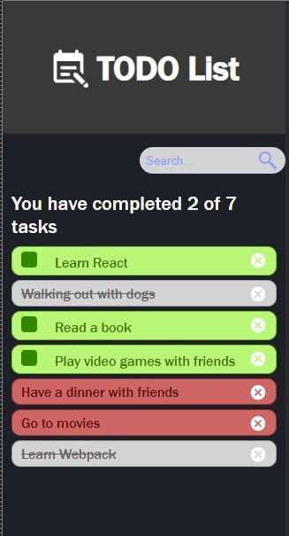

# todo-list
React project. This project uses react hooks and styled components



## Installation

Download the repository

```
git clone https://github.com/ecabrera78/todo-list.git
```

Install the dependencies

```
npm install
```

## How to use

Run the dev instance

```
npm run dev
```

## License

[MIT](https://choosealicense.com/licenses/mit/)